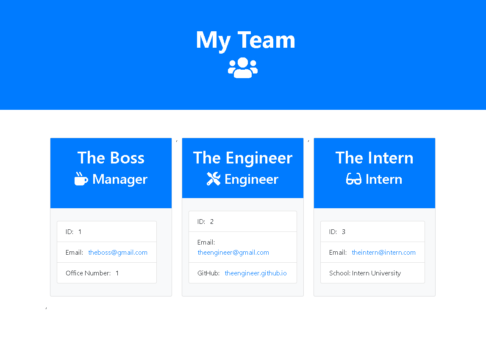

# Team Profile Generator

## App Demo

## Instructions

To run the app run:  
    node app.js

User will be prompted to submit user information for roles of your choice starting witht he manager then Engineer, and Intern. An HTML page will be generated when you select not to add additonal roles. By clicking on e-mail and GitHub username will open an outside link to either your email client to send an email or a Github Profile page to view aprofile. 

Jest unit testing package is included and used to pass all tests and can be done by:
  npm run test

## Built with

HTML
JavaScript
Jest
Inquirer
Node.js
