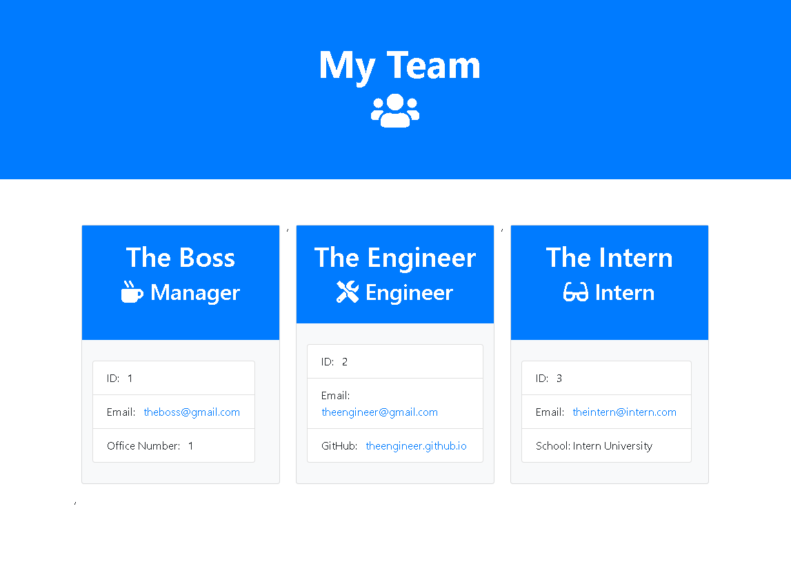

# Team Profile Generator

## APP DEMO

### INSTRUCTIONS

User will be prompted to submit user information of your choice starting with a manager, engineer, and an intern. A HTML page will be generated when you select not to add additional roles. By clicking on e-mail and GitHub username will open an outside link to your e-mail client to send an e-mail or a GitHub profile page to view a profile.

### START APP

    node app.js

### TESTING

Jest, a unit testing package is included and used to pass all tests and can be done in the terminal with the following commands below.

    npm run test

### BUILT WITH

* HTML
* CSS
* JavaScript
* Jest
* Inquirer
* Node.js
